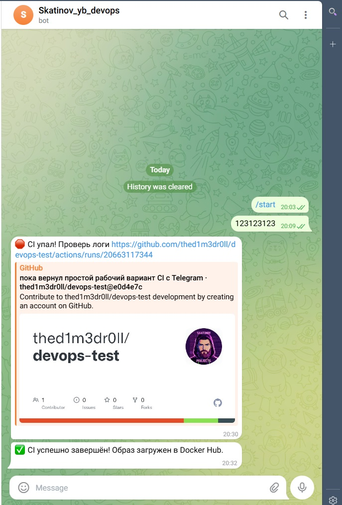

# 🚀 DevOps test — Docker Nginx (A1)

Небольшой, но боевой DevOps-проект: статический сайт **"Hello from Skatinov_dev"** на Nginx в Docker-контейнере, запущенный через Docker Compose под WSL Ubuntu 24.04.

---

## 📄 Описание

- Контейнер с Nginx на базе лёгкого образа `nginx:alpine`.
- Статическая страница `index.html` с текстом **Hello from Skatinov_dev**.
- Запуск и управление через `docker-compose`.
- Всё крутится внутри WSL Ubuntu 24.04 на локальной машине.

---

## 🛠 Стек и требования

- 🖥️ WSL **Ubuntu 24.04**
- 🐳 **Docker Engine**
- 📦 **Docker Compose**
- 🌐 **Браузер** (проверка `http://localhost:8080`)

---

## 📁 Структура проекта

```
devops-test
├── Dockerfile
├── docker-compose.yml
├── src
│   └── index.html        # Страница "Hello from Skatinov_dev"
└── docs
    └── screenshots
        └── A1            # Скриншоты docker-compose и браузера
        └── B1            # Скриншоты работы скрипта
        └── B2            # Скриншоты Git Bash со сценарием работы с веткой
        └── B3            # уведомления Telegram‑бота о падении и успешном завершении CI
```

- `Dockerfile` — сборка образа на базе `nginx:alpine` и копирование `src/index.html` в веб-каталог Nginx.
- `docker-compose.yml` — сервис `web`, проброс порта `8080:80` и политика перезапуска `unless-stopped`.

---

## 🐳 Dockerfile

```dockerfile
FROM nginx:alpine

WORKDIR /usr/share/nginx/html
RUN rm -f /usr/share/nginx/html/*
COPY src/index.html /usr/share/nginx/html/index.html

EXPOSE 80
CMD ["nginx", "-g", "daemon off;"]
```

---

## ⚙️ docker-compose.yml

```yaml
version: "3.9"

services:
  web:
    build:
      context: .
      dockerfile: Dockerfile
    container_name: devops-test-web
    ports:
      - "8080:80"
    restart: unless-stopped
```

---

## ▶️ Запуск под WSL Ubuntu 24.04

```bash
# 1. Клонировать репозиторий
git clone https://github.com/thed1m3dr0ll/devops-test.git
cd devops-test

# 2. Собрать и запустить контейнер
docker-compose up -d --build

# 3. Проверить состояние сервиса
docker-compose ps

# 4. Проверить ответ Nginx через curl
curl http://localhost:8080 | head -n 5
```

После запуска страница доступна по адресу `http://localhost:8080` и отображает текст **Hello from Skatinov_dev**.

Остановить контейнер:

```bash
docker-compose down
```

---

## 🖼️ Скриншоты A1

Ниже скриншоты, подтверждающие выполнение задания A1:

- ✅ `A1-docker-compose-up.jpg` — успешный `docker-compose up -d --build`.
- ✅ `A1-docker-compose-ps.jpg` — контейнер `devops-test-web` в состоянии `Up`.
- ✅ `A1-curl-localhost.jpg` — ответ Nginx с кодом 200 на `curl http://localhost:8080`.
- ✅ `A1-browser-ok.jpg` — страница в браузере с текстом **Hello from Skatinov_dev**.

<p align="center"><em>Screenshots A1</em></p>
<p align="center"></p>
<p align="center"></p>
<p align="center"></p>
<p align="center"></p>

---

## 📋 Кратко о задании A1

- 🐳 Собрать Docker-образ на базе `nginx:alpine` с кастомным `index.html`.
- 🌐 Поднять сервис через `docker-compose` с пробросом порта `8080 → 80`.
- 📸 Зафиксировать результат скриншотами (`up`, `ps`, `curl`, браузер) в `docs/screenshots/A1`.
- 📝 Описать всё в этом README.md и выложить в GitHub репозиторий `devops-test`.

---

## 🧹 B1 — Bash‚скрипт очистки логов

Небольшой помощник для безопасной очистки старых `.log`‚файлов в заданной директории с подтверждением перед удалением.

---

## 🧩 Назначение скрипта

- Ищет в указанной папке все файлы с расширением `.log`, которые старше заданного количества дней.
- Показывает список найденных файлов и их общее количество, затем спрашивает, удалять ли их.
- При ответе `y` удаляет только отобранные файлы, при `n` — ничего не меняет и завершает работу.

---

### 📁 Расположение в проекте

```
devops-test
├── scripts
│   └── cleanoldlogs.sh   # Скрипт очистки старых .log-файлов
└── docs
    └── screenshots
        └── B1            # Скриншоты работы скрипта
```

---

### ▶️ Использование

```
# Общий формат
./scripts/cleanoldlogs.sh /path/to/logs N

# Пример: удалить .log-файлы старше 30 дней
./scripts/cleanoldlogs.sh /var/log/myapp 30
```

Где:
- `/path/to/logs` — путь к директории с логами;
- `N` — количество дней, старше которого `.log` считаются устаревшими.

---

### 🔍 Поведение скрипта

- При отсутствии или некорректных аргументах выводит подсказку по использованию и завершает работу.
- Если подходящих `.log`‚файлов нет, сообщает об этом и ничего не удаляет.
- Перед удалением всегда выводит список файлов и запрашивает подтверждение: `Удалить эти файлы? (Y/N)`.

---

### 🖼️ Скриншоты B1

<p align="center"><em>screenshots B1</em></p>
<p align="center"></p>
<p align="center"></p>

---

## 📋 Кратко о задании B1

- 🧹 Создать bash-скрипт `cleanoldlogs.sh`, который ищет и удаляет `.log`-файлы старше заданного количества дней с подтверждением.
- 🧩 Скрипт принимает два аргумента: путь к директории и количество дней.
- ✅ Перед удалением выводит список найденных файлов и запрашивает подтверждение (`Y/N`).
- 📸 Зафиксировать результат скриншотами (`help`, `demo`) в `docs/screenshots/B1`.
- 📝 Описать всё в этом README.md и выложить в GitHub репозиторий `devops-test`.

---

## 🚀 B2 — Git‑сценарий с веткой, stash и переименованием коммита
Сценарий демонстрирует, как сохранить незакоммиченные изменения через git stash, переключиться на main для горячего фикса, затем вернуться в feature/junior-task и переименовать последний коммит с помощью git commit --amend.

---

## 📁 Структура проекта

```
devops-test
├── feature_work.txt          # Файл с изменениями в feature/junior-task
├── main_fix.txt              # Файл с фиксом на main
└── docs
    └── screenshots
        └── B2
            └── B2-git-scenario-complete.jpg
```

- Скриншот `B2-git-scenario-complete.jpg` показывает все ключевые шаги: stash, переключение между ветками, коммиты и итоговый `git log --oneline`.
  
---

## ▶️ Выполнение Git‑сценария B2

```bash
# 1. Перейти в feature/junior-task и сделать незакоммиченные изменения
git checkout feature/junior-task
echo "временное изменение $(date)" >> feature_work.txt
git status

# 2. Сохранить незакоммиченные изменения в stash
git stash
git status

# 3. Переключиться на main и сделать горячий фикс
git checkout main
echo "горячий фикс $(date)" >> main_fix.txt
git add main_fix.txt
git commit -m "Горячий фикс на main для B2"
git log --oneline -3

# 4. Вернуться в feature/junior-task и восстановить stash
git checkout feature/junior-task
git stash pop
git status

# 5. Зафиксировать изменения и переименовать последний коммит
git add feature_work.txt
git commit -m "Временный коммит junior-task"
git commit --amend -m "Доработанная реализация junior-task"
git log --oneline -5
```
В результате:

незакоммиченные изменения не теряются при переключении ветки, так как временно сохраняются в stash;
​
ветка `main` получает отдельный «горячий» фикс;

в `feature/junior-task` изменения восстанавливаются, коммит создаётся и затем переименовывается через `git commit --amend`, что отражается в истории `git log --oneline`.

---

🖼️ **Скриншот B2**
<p align="center"><em>Screenshots B2</em></p> <p align="center"></p>

✅ `B2-git-scenario-complete.jpg` — полный вывод Git Bash со сценарием: попытка переключения с незакоммичеными изменениями, `git stash`, фиксы на `main`, возврат в `feature/junior-task`, `git stash pop`, коммит и `git commit --amend` с итоговой историей `git log --oneline`.
​


---

## 🚀 B3 — CI/CD с Docker Hub и Telegram

Полная автоматизация: GitHub Actions собирает Docker-образ, пушит его в Docker Hub и отправляет уведомления в Telegram.

---

### 🛠 Стек B3

- 🐙 **GitHub Actions** — CI/CD pipeline.
- 🐳 **Docker Hub** — реестр образов.
- 📱 **Telegram Bot API** — уведомления.
- 🔑 **GitHub Secrets** — безопасное хранение токенов.

---

### 🤖 Полный процесс CI/CD

1. 📝 **Пуш разработчика** в ветку `main`
2. 🤖 **Запуск CI/CD пайплайна** (GitHub Actions / GitLab CI)
3. 📄 **Checkout кода** репозитория
4. 🧪 **Запуск тестов**
   - ❌ При падении тестов → 📢 отправка уведомления в Telegram о провале
   - ✅ При успешных тестах → переход к следующему шагу
5. 🛠 **Сборка Docker-образа**
6. 🔐 **Логин в Docker Hub** (или другой реестр)
7. 🐳 **Пуш Docker-образа** в реестр
8. ✅❌ **Проверка статуса сборки/публикации**
   - ✅ Успех → 📢 отправка уведомления в Telegram об успешном деплое
   - ❌ Ошибка → 📢 отправка уведомления в Telegram о проблеме

---

### 📱 Telegram уведомления

**Требуемые секреты в GitHub:**
- `TELEGRAM_BOT_TOKEN` — токен бота.
- `TELEGRAM_CHAT_ID` — ID чата.
- `DOCKERHUB_USERNAME` — логин Docker Hub.
- `DOCKERHUB_TOKEN` — токен Docker Hub.

---

### 🖼️ Скриншот B3

<p align="center"><em>Telegram Notifications (Success & Failure)</em></p>
<p align="center"></p>

---

### 📋 Кратко о задании B3

- 🔄 GitHub Actions workflow для CI/CD.
- 🐳 Собирает Docker-образ и загружает в Docker Hub.
- 📱 Отправляет Telegram-уведомления (успех/ошибка).
- 🔑 Использует GitHub Secrets для токенов.
- 📸 Скриншоты в `docs/screenshots/B3/`.

---
     
## ✅ Итого: A1 + B1 + B2 + B3

---

Все задания выполнены! 🎉
