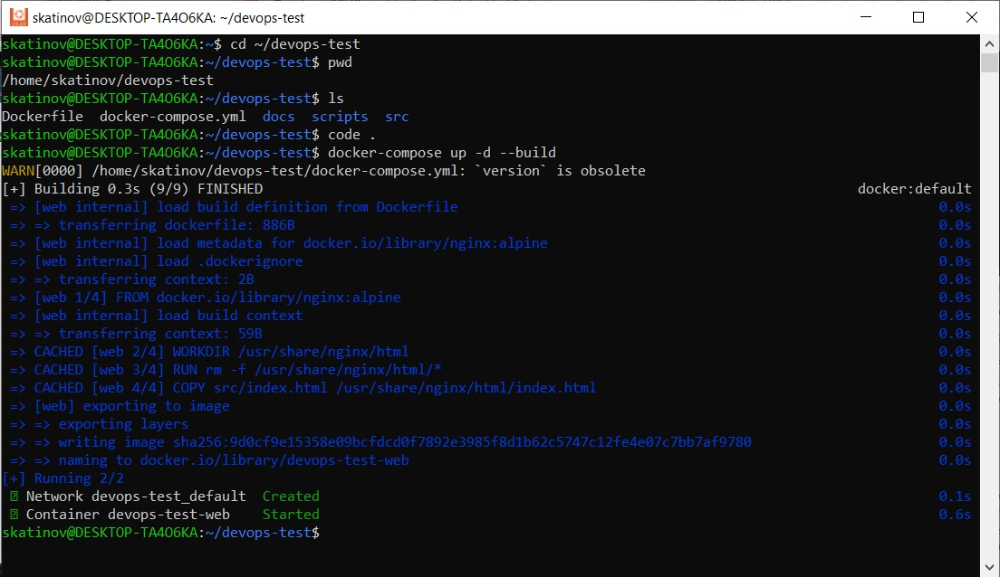
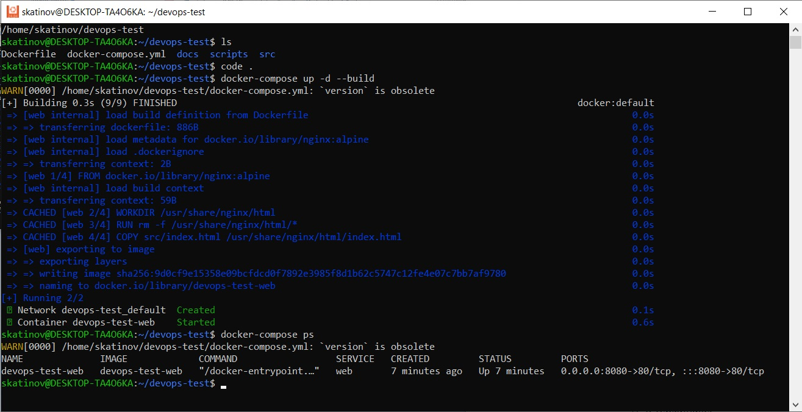
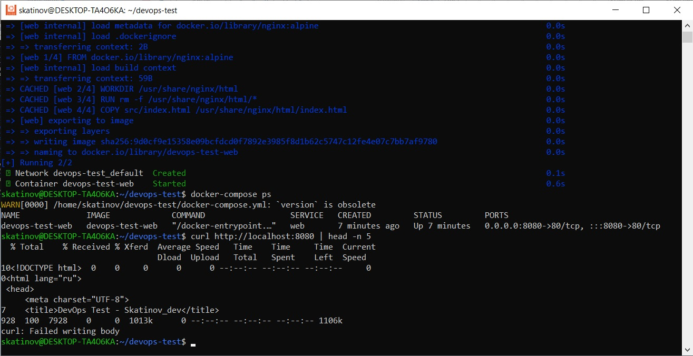
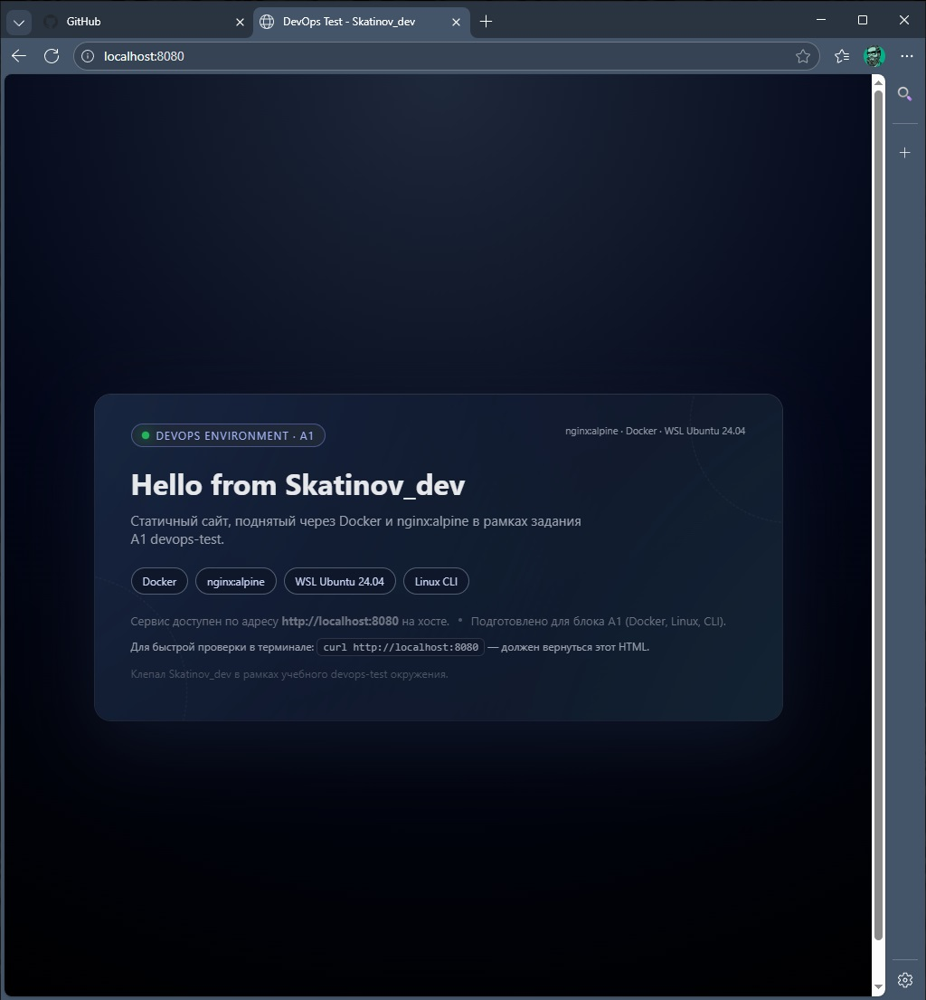
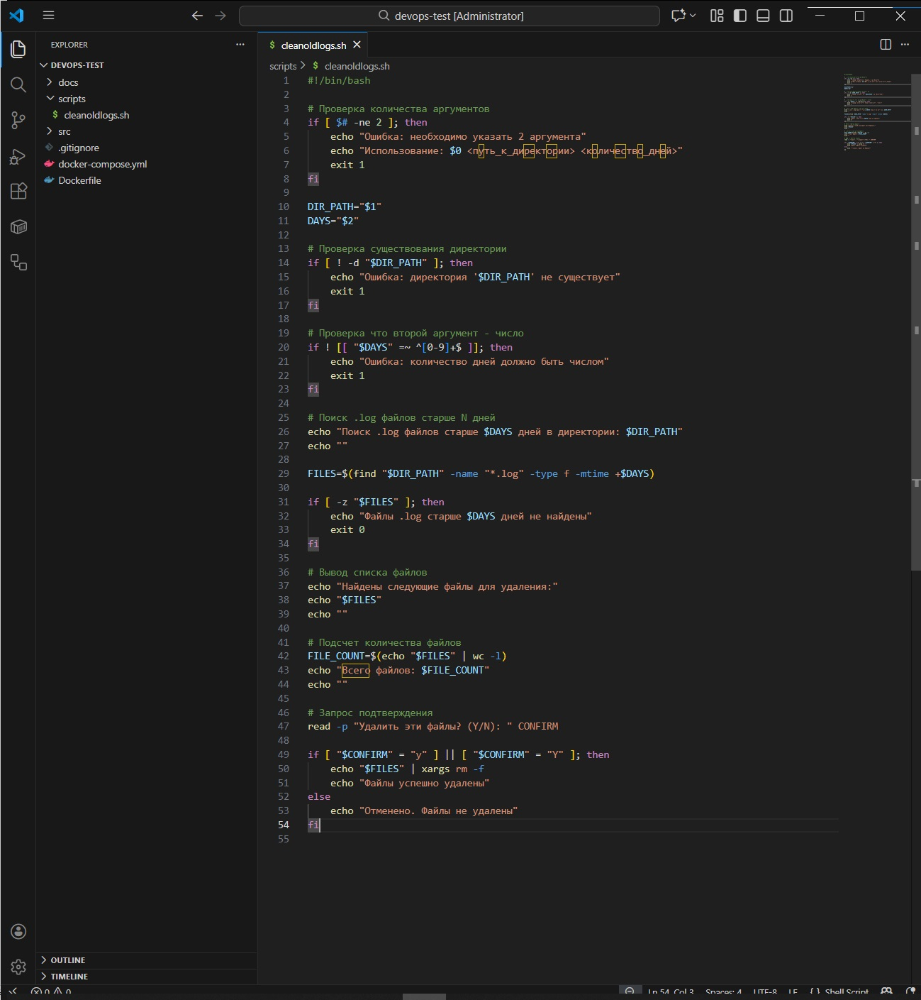
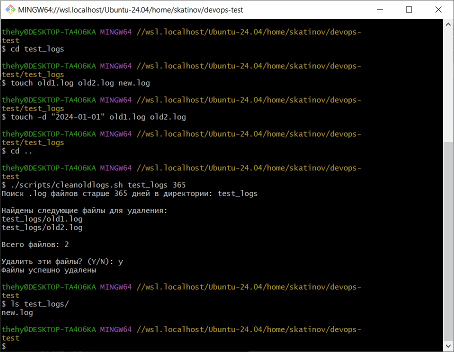
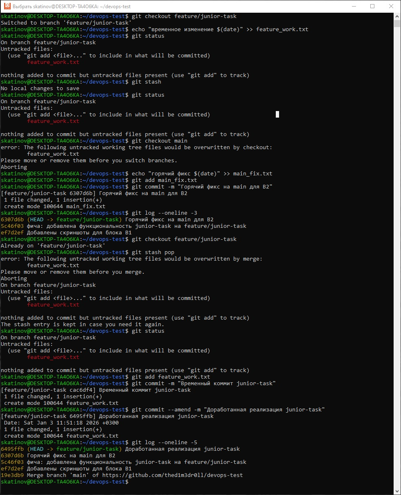

# 🚀 DevOps test — Docker Nginx (A1)

Небольшой, но боевой DevOps-проект: статический сайт **"Hello from Skatinov_dev"** на Nginx в Docker-контейнере, запущенный через Docker Compose под WSL Ubuntu 24.04.

---

## 📄 Описание

- Контейнер с Nginx на базе лёгкого образа `nginx:alpine`.
- Статическая страница `index.html` с текстом **Hello from Skatinov_dev**.
- Запуск и управление через `docker-compose`.
- Всё крутится внутри WSL Ubuntu 24.04 на локальной машине.

---

## 🛠 Стек и требования

- 🖥️ WSL **Ubuntu 24.04**
- 🐳 **Docker Engine**
- 📦 **Docker Compose**
- 🌐 Браузер (проверка `http://localhost:8080`)

---

## 📁 Структура проекта

```
devops-test
├── Dockerfile
├── docker-compose.yml
├── src
│   └── index.html        # Страница "Hello from Skatinov_dev"
└── docs
    └── screenshots
        └── A1            # Скриншоты docker-compose и браузера
```

- `Dockerfile` — сборка образа на базе `nginx:alpine` и копирование `src/index.html` в веб-каталог Nginx.
- `docker-compose.yml` — сервис `web`, проброс порта `8080:80` и политика перезапуска `unless-stopped`.

---

## 🐳 Dockerfile

```dockerfile
FROM nginx:alpine

WORKDIR /usr/share/nginx/html
RUN rm -f /usr/share/nginx/html/*
COPY src/index.html /usr/share/nginx/html/index.html

EXPOSE 80
CMD ["nginx", "-g", "daemon off;"]
```

---

## ⚙️ docker-compose.yml

```yaml
version: "3.9"

services:
  web:
    build:
      context: .
      dockerfile: Dockerfile
    container_name: devops-test-web
    ports:
      - "8080:80"
    restart: unless-stopped
```

---

## ▶️ Запуск под WSL Ubuntu 24.04

```bash
# 1. Клонировать репозиторий
git clone https://github.com/thed1m3dr0ll/devops-test.git
cd devops-test

# 2. Собрать и запустить контейнер
docker-compose up -d --build

# 3. Проверить состояние сервиса
docker-compose ps

# 4. Проверить ответ Nginx через curl
curl http://localhost:8080 | head -n 5
```

После запуска страница доступна по адресу `http://localhost:8080` и отображает текст **Hello from Skatinov_dev**.

Остановить контейнер:

```bash
docker-compose down
```

---

## 🖼️ Screenshots A1

Ниже скриншоты, подтверждающие выполнение задания A1:

- ✅ `A1-docker-compose-up.jpg` — успешный `docker-compose up -d --build`.
- ✅ `A1-docker-compose-ps.jpg` — контейнер `devops-test-web` в состоянии `Up`.
- ✅ `A1-curl-localhost.jpg` — ответ Nginx с кодом 200 на `curl http://localhost:8080`.
- ✅ `A1-browser-ok.jpg` — страница в браузере с текстом **Hello from Skatinov_dev**.

<p align="center"><em>Screenshots A1</em></p>
<p align="center"></p>
<p align="center"></p>
<p align="center"></p>
<p align="center"></p>

---

## 📋 Кратко о задании A1

- 🐳 Собрать Docker-образ на базе `nginx:alpine` с кастомным `index.html`.
- 🌐 Поднять сервис через `docker-compose` с пробросом порта `8080 → 80`.
- 📸 Зафиксировать результат скриншотами (`up`, `ps`, `curl`, браузер) в `docs/screenshots/A1`.
- 📝 Описать всё в этом README.md и выложить в GitHub репозиторий `devops-test`.

---

## 🧹 B1 — Bash‚скрипт очистки логов

Небольшой помощник для безопасной очистки старых `.log`‚файлов в заданной директории с подтверждением перед удалением.

---

### 🧩 Назначение скрипта

- Ищет в указанной папке все файлы с расширением `.log`, которые старше заданного количества дней.
- Показывает список найденных файлов и их общее количество, затем спрашивает, удалять ли их.
- При ответе `y` удаляет только отобранные файлы, при `n` — ничего не меняет и завершает работу.

---

### 📁 Расположение в проекте

```
devops-test
├── scripts
│   └── cleanoldlogs.sh   # Скрипт очистки старых .log-файлов
└── docs
    └── screenshots
        └── B1            # Скриншоты работы скрипта
```

---

### ▶️ Использование

```
# Общий формат
./scripts/cleanoldlogs.sh /path/to/logs N

# Пример: удалить .log-файлы старше 30 дней
./scripts/cleanoldlogs.sh /var/log/myapp 30
```

Где:
- `/path/to/logs` — путь к директории с логами;
- `N` — количество дней, старше которого `.log` считаются устаревшими.

---

### 🔍 Поведение скрипта

- При отсутствии или некорректных аргументах выводит подсказку по использованию и завершает работу.
- Если подходящих `.log`‚файлов нет, сообщает об этом и ничего не удаляет.
- Перед удалением всегда выводит список файлов и запрашивает подтверждение: `Удалить эти файлы? (Y/N)`.

---

### 🖼️ Screenshots B1

<p align="center"><em>Screenshots B1</em></p>
<p align="center"></p>
<p align="center"></p>

---

## 📋 Кратко о задании B1

- 🧹 Создать bash-скрипт `cleanoldlogs.sh`, который ищет и удаляет `.log`-файлы старше заданного количества дней с подтверждением.
- 🧩 Скрипт принимает два аргумента: путь к директории и количество дней.
- ✅ Перед удалением выводит список найденных файлов и запрашивает подтверждение (`Y/N`).
- 📸 Зафиксировать результат скриншотами (`help`, `demo`) в `docs/screenshots/B1`.
- 📝 Описать всё в этом README.md и выложить в GitHub репозиторий `devops-test`.

---

## 🚀 Запуск Git сценария B2
Git сценарий предполагает работу с ветками, стешем и переименованием коммитов:


## 🚀 Выполнение Git сценария B2

Описание выполнения гит-сценария с работой в нескольких ветках, стешем и переименованием коммитов:

```bash
# Шаг 1: создать новую ветку feature/junior-task
git checkout -b feature/junior-task

# Шаг 2: сделать изменения в ветке и скоммитить
echo "исправленная фича" > feature_changes.txt
git add feature_changes.txt
git commit -m "Implement junior-task feature"

# Шаг 3: сохранить некоммиттед изменения
git stash

# Шаг 4: переключиться на main
git checkout main

# Шаг 5: сделать вместе исправления на main
echo "сборки" > main_changes.txt
git add main_changes.txt
git commit -m "Update main branch"

# Шаг 6: вернуться на feature ветку
git checkout feature/junior-task

# Шаг 7: восстановить сохранённые при стеш изменения
git stash pop

# Шаг 8: переименовать последний коммит
git commit --amend -m "Refined junior-task implementation"
```

По завершении всех шагов приложен скриншот, который показывает все этапы эксекуции.

<p align="center"><em>Screenshots B2</em></p>

<p align="center"></p>
---

## 📋 Кратко о задании B2

- 🔀 Создать ветку `feature/junior-task` с коммитом и сохранить изменения в стеш.
- 🔄 Переключиться на `main`, внести изменения и коммитить.
- 🔙 Вернуться на `feature/junior-task` и восстановить изменения из стеша.
- ✏️ Переименовать последний коммит с использованием `git commit --amend`.
- 📸 Зафиксировать результат скриншотом в `docs/screenshots/B2`.

<p align="center"><em>Screenshots B2</em></p>
<p align="center"></p>

